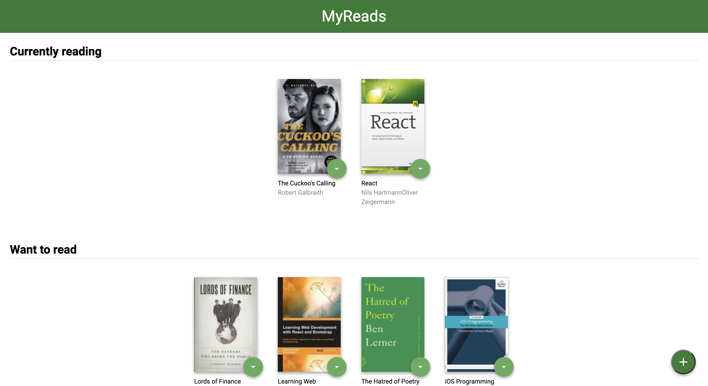
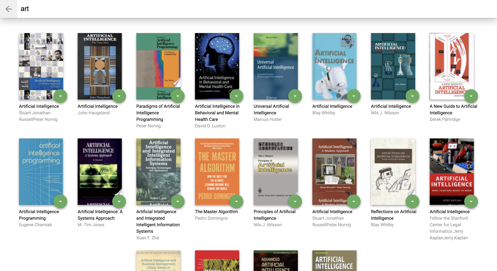

# Read Haven

Read Haven is a web application that allows you categorize and add books to your shelves with the following headings :

- Currently Reading
- Want To Read
- Read

It also allows you search for books by the title or author and add them to your shelves




## Installation

- install all project dependencies with `npm install`

- start the development server with `npm start`

```bash
npm install
npm start
```

## Resources Used

I learnt how to use debounce in my search page from this wonderful article [ How to Use Debounce and Throttle in React and Abstract them into Hooks](https://www.freecodecamp.org/news/debounce-and-throttle-in-react-with-hooks/) by [Divyanshu Maithani](https://www.freecodecamp.org/news/author/divyanshu/)

I also benefitted from the guidance of a friend [Qasim-Yusuf](https://github.com/Qausim) who tried as much as possible to make sure I read up on some concepts and also explained some to me. Plus also making fun of me.

## Comments & Collaboration

For comments, suggestions and collaboration all you can reach me on LinkedIn [Adedeji-Adelanwa](https://www.linkedin.com/in/adelanwaadedeji/)
